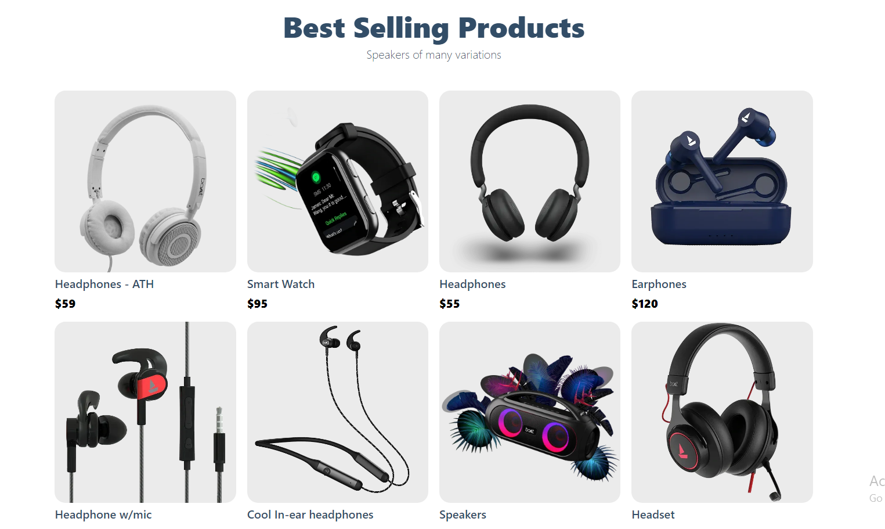

# Headphones
Headphones is a Full Stack Ecommerce application with Payments functionality. With Modern design, animations, the ability to add and edit, delet products by using sanity as a backend, all advanced cart functionalities, and most importantly the complete integration with Stripe so that you can cover REAL payments.

 

 

## Live Site:  
   - Link: https://gym-exercs.netlify.app/

## Features
  - Advanced React Best Practices such as
    - Folder and file structure, hooks and refs
  - Advanced State Management of the entire application using React Context API
  - Next.js Best Practices such as
    - File-based routing, Data fetching that allows server-side rendering and static generation which makes your websites incredibly optimized (show getServerSideProps, getStaticPaths, getStaticProps), and Next.js as a backend endpoint.
  - Use Stripe to integrate Stripe to manage payments, products, shipping rates, and the entire checkout process
  - Manage the entire content of your app using Sanity. Sanity is the    unified content platform that’ll make the making of our entire app  possible.
  - Through Sanity, you or your clients will be able to change the store’s homepage and more importantly, the details of all the products in the store, instantly and on the go!
  - Sanity allows us to focus on developing the application without having to worry about the content, file storage, and databases. They’ll cover the dirty work for us and allow us to build scalable and modern e-commerce web applications extremely easily.

## Technologies
Project is created with:
   - Next.js
   - Stripe
   - Sanity
   - React Hooks (useState, useEffect)
   - css
   - Responsevie Layout

